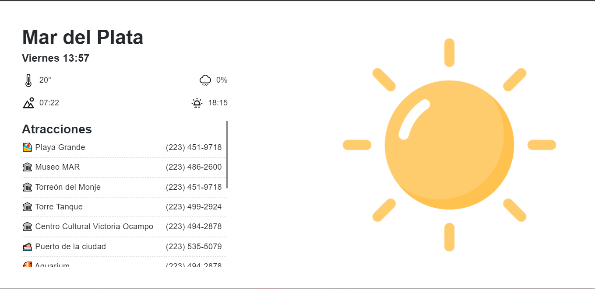

# Simple, informative and minimalist website about the city of [*Mar del Plata*](https://mar-del-plata.netlify.app) in real time.

Visit the website clicking [here!](https://mar-del-plata.netlify.app)

## Description:

Functionalities:
- We can find the display of data of the city in real time such as: day and time, temperature, sunrise, sunset and rain probabilities.

- On the right side of the screen you can appreciate the appearance of an icon style image, respective to the weather that the city is experiencing in real time.

## Images:

## Technologies:
- Built with Gatsby.js, using Node, React and CSS. 

- Deployment performed with Netlify.

- The website uses the OpenWeatherMap API to extract weather information.